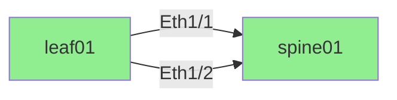

# nw-check 改良提案 / Improvement Proposals

このドキュメントは、nw-checkツールの利用シチュエーションを考慮した改良提案をまとめたものです。
既存機能に変更を加えず、後方互換性を保ちながら追加できる機能を提案します。

This document outlines improvement proposals for the nw-check tool based on usage scenarios.
All proposals maintain backward compatibility without changing existing functionality.

---

## 利用シチュエーション / Usage Scenarios

### 1. 初期構築時の配線確認 / Initial Build Wiring Verification
新規データセンターやネットワーク構築時に、実際の配線が設計通りかを確認する。

### 2. 定期メンテナンス時の配線監査 / Periodic Maintenance Audit
定期的に配線状態を確認し、意図しない変更や誤配線を検出する。

### 3. トラブルシューティング / Troubleshooting
ネットワーク障害発生時に、配線状態を迅速に把握する。

### 4. CI/CD パイプラインでの自動検証 / Automated Validation in CI/CD
Infrastructure as Code (IaC) の一部として、配線定義の変更を自動検証する。

### 5. 大規模環境での並列実行 / Parallel Execution in Large Environments
数百台規模のデバイスに対して効率的にLLDP情報を収集する。

---

## 改良提案 / Improvement Proposals

### 1. JSON出力フォーマット対応 / JSON Output Format Support

**目的 / Purpose:**
API連携やプログラマティックな処理を容易にするため、JSON形式での出力を追加する。

**実装内容 / Implementation:**
- 新しいコマンドラインオプション: `--output-format {csv,json,both}`
- As-Isリンク、差分、サマリーをJSON形式で出力
- 既存のCSV出力は維持（デフォルト）

**利用シナリオ / Use Cases:**
- 監視システムやダッシュボードとの連携
- チケットシステムへの自動通知
- カスタムレポート生成ツールとの統合

**実装ファイル / Implementation Files:**
- `nw_check/output.py`: JSON出力関数を追加
- `nw_check/cli.py`: `--output-format` オプションを追加
- `tests/test_output.py`: JSON出力のテストを追加

---

### 2. プログレス表示機能 / Progress Reporting

**目的 / Purpose:**
大規模環境でのSNMP収集時に、進捗状況をリアルタイムで確認できるようにする。

**実装内容 / Implementation:**
- 新しいコマンドラインオプション: `--show-progress`
- デバイス収集の進捗をパーセンテージとデバイス名で表示
- 推定残り時間の表示

**利用シナリオ / Use Cases:**
- 数百台規模の収集時の進捗確認
- 収集が停止していないかの確認
- 完了予定時刻の把握

**実装ファイル / Implementation Files:**
- `nw_check/lldp_snmp.py`: プログレス表示ロジックを追加
- `nw_check/cli.py`: `--show-progress` オプションを追加

---

### 3. 設定ファイル対応 / Configuration File Support

**目的 / Purpose:**
複雑なコマンドライン引数を設定ファイルで管理し、実行を簡素化する。

**実装内容 / Implementation:**
- YAML/JSON形式の設定ファイルをサポート
- コマンドラインオプション: `--config <file.yaml>`
- コマンドライン引数は設定ファイルの値を上書き可能

**設定ファイル例 / Example Configuration:**
```yaml
devices: samples/devices.csv
tobe: samples/tobe.csv
out_dir: output/
snmp_timeout: 5
snmp_retries: 2
log_level: DEBUG
output_format: json
show_progress: true
```

**利用シナリオ / Use Cases:**
- 環境ごとの設定管理（開発、本番など）
- 設定のバージョン管理
- チーム内での設定共有

**実装ファイル / Implementation Files:**
- `nw_check/config.py`: 設定ファイル読み込み機能（新規作成）
- `nw_check/cli.py`: `--config` オプションを追加
- `tests/test_config.py`: 設定ファイルのテスト（新規作成）

---

### 4. ドライラン（dry-run）モード / Dry-run Mode

**目的 / Purpose:**
実際のSNMPクエリを実行せず、サンプルデータや過去の結果を使って差分検証をテストする。

**実装内容 / Implementation:**
- 新しいコマンドラインオプション: `--dry-run`
- サンプルLLDPデータをJSONで保存・読み込み
- `--load-observations <file.json>` で過去の収集結果を再利用

**利用シナリオ / Use Cases:**
- To-Be定義の変更テスト
- 本番実行前の動作確認
- オフライン環境でのレポート生成
- CI/CDでのテスト実行

**実装ファイル / Implementation Files:**
- `nw_check/cli.py`: `--dry-run`, `--load-observations`, `--save-observations` オプションを追加
- `nw_check/lldp_snmp.py`: 観測データの保存・読み込み機能を追加
- `tests/test_cli.py`: ドライランモードのテスト追加

---

### 5. Mermaid図の生成 / Mermaid Diagram Generation

**目的 / Purpose:**
ネットワーク構成を視覚的に確認できるよう、Mermaid形式の図を生成する。

**実装内容 / Implementation:**
- 新しいコマンドラインオプション: `--generate-mermaid`
- As-Isリンクから `graph LR` 形式のMermaid図を生成
- ノード数制限オプション: `--mermaid-max-nodes <n>` (デフォルト: 50)
- 差分ステータスに応じた色分け（EXACT_MATCH: 緑、MISMATCH: 赤など）

**Mermaid出力例 / Example Output:**


**利用シナリオ / Use Cases:**
- ドキュメント作成時の図の自動生成
- レビュー時の視覚的な確認
- プレゼンテーション資料作成

**実装ファイル / Implementation Files:**
- `nw_check/mermaid.py`: Mermaid生成機能（新規作成）
- `nw_check/cli.py`: `--generate-mermaid`, `--mermaid-max-nodes` オプションを追加
- `nw_check/output.py`: Mermaidファイル出力を追加
- `tests/test_mermaid.py`: Mermaid生成のテスト（新規作成）

---

### 6. フィルタリング機能 / Filtering Options

**目的 / Purpose:**
大規模環境で特定のデバイスやステータスのみを対象とした分析を可能にする。

**実装内容 / Implementation:**
- デバイス名フィルター: `--filter-devices <device1,device2,...>`
- ステータスフィルター: `--filter-status <EXACT_MATCH,PORT_MISMATCH,...>`
- 正規表現サポート: `--filter-devices-regex <pattern>`

**利用シナリオ / Use Cases:**
- 特定のラックやロケーションのみを確認
- ミスマッチのみを抽出
- 段階的な配線確認作業

**実装ファイル / Implementation Files:**
- `nw_check/filters.py`: フィルタリング機能（新規作成）
- `nw_check/cli.py`: フィルター関連オプションを追加
- `nw_check/output.py`: フィルター適用後の出力
- `tests/test_filters.py`: フィルタリングのテスト（新規作成）

---

### 7. 並列SNMP収集 / Parallel SNMP Collection

**目的 / Purpose:**
大規模環境での収集時間を短縮するため、複数デバイスへの並列SNMP収集を実装する。

**実装内容 / Implementation:**
- 新しいコマンドラインオプション: `--parallel-workers <n>` (デフォルト: 1)
- `concurrent.futures.ThreadPoolExecutor` を使用した並列化
- 最大同時実行数の制限（デフォルト: 10）

**利用シナリオ / Use Cases:**
- 数百台規模のデバイスからの迅速な収集
- メンテナンス時間の短縮
- 定期実行時の処理時間削減

**実装ファイル / Implementation Files:**
- `nw_check/lldp_snmp.py`: 並列収集ロジックを追加
- `nw_check/cli.py`: `--parallel-workers` オプションを追加
- `tests/test_lldp_snmp.py`: 並列収集のテスト追加

---

## 追加提案 / Additional Proposals

### 8. 差分の詳細分析レポート / Detailed Diff Analysis Report

**目的 / Purpose:**
単純な差分だけでなく、傾向分析や統計情報を提供する。

**実装内容 / Implementation:**
- デバイスごとのミスマッチ統計
- ポートタイプ別の統計（アップリンク、ダウンリンクなど）
- 時系列での差分変化追跡（過去実行結果と比較）

---

### 9. Webhook通知機能 / Webhook Notification

**目的 / Purpose:**
実行完了時や重大な差分検出時に、SlackやTeamsなどへ通知する。

**実装内容 / Implementation:**
- `--webhook-url <url>` オプション
- 通知テンプレートのカスタマイズ
- 重要度に応じた通知フィルター

---

### 10. 差分の自動修正提案 / Auto-correction Suggestions

**目的 / Purpose:**
検出された差分に対して、修正手順や推奨アクションを提案する。

**実装内容 / Implementation:**
- ミスマッチタイプごとの修正手順テンプレート
- 作業指示書の自動生成
- 変更リスク評価の表示

---

## 実装優先順位 / Implementation Priority

### 高優先度 / High Priority
1. JSON出力フォーマット対応 - API連携で重要
2. プログレス表示機能 - ユーザビリティ向上
3. 設定ファイル対応 - 運用効率化

### 中優先度 / Medium Priority
4. ドライランモード - テスト容易性向上
5. Mermaid図の生成 - 視覚化ニーズ
6. フィルタリング機能 - 大規模環境対応

### 低優先度 / Low Priority
7. 並列SNMP収集 - パフォーマンス最適化
8-10. 追加提案 - 高度な機能

---

## 実装上の注意点 / Implementation Notes

### 後方互換性の維持 / Maintaining Backward Compatibility
- すべての新機能はオプトイン（デフォルトでは既存動作）
- 既存のCSV出力形式は変更しない
- 既存のコマンドライン引数は維持

### テストカバレッジ / Test Coverage
- 各新機能に対応する単体テストを追加
- 既存テストがすべてパスすることを確認
- エッジケースのテストも含める

### ドキュメント / Documentation
- README.mdに新機能の説明を追加
- 使用例を含めたチュートリアルを作成
- 設定ファイルのスキーマドキュメントを提供

---

## まとめ / Summary

このドキュメントでは、nw-checkツールの7つの主要な改良提案と3つの追加提案を提示しました。
これらの改良により、以下の利点が期待できます：

1. **運用効率の向上**: 設定ファイル対応、プログレス表示により実行が簡単に
2. **柔軟性の向上**: JSON出力、フィルタリングにより様々な用途に対応
3. **スケーラビリティ**: 並列収集により大規模環境でも高速に動作
4. **テスト容易性**: ドライランモードにより安全なテストが可能
5. **視覚化**: Mermaid図により直感的な理解が可能

すべての改良は既存機能を損なわず、後方互換性を保ちながら追加されます。
