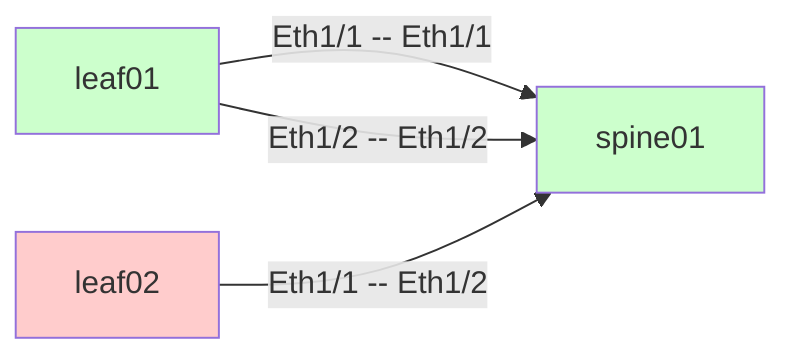

<!--
Copyright 2024 nw-check contributors
SPDX-License-Identifier: Apache-2.0

This file was created or modified with the assistance of an AI (Large Language Model).
Review required for correctness, security, and licensing.
-->

# nw-check

[English](README.md) | 日本語

## 要件

### 機能要件

- SNMPを介してターゲットデバイスからLLDPネイバー情報を収集し、リンクのAs-Isビューを構築する。
- As-Isリンクを配線定義のTo-Beと比較し、不一致や欠落を分類する。
- 人が確認できる表形式のレポートを出力する:
  - As-Isで観測されたリンク
  - To-Be vs As-Isの差分結果（明示的な理由付き）
  - 失敗、欠落データ、不一致のサマリー
- デバイスインベントリとTo-Be配線のCSV入力をサポートする。
- 欠落または不確実なデータを明示的にする（例: 不明なデバイス、部分的な観測）。

### 非機能要件

- Linux/WSL/WindowsのPythonランタイム上で動作する。
- マルチベンダーデバイスとLLDPスキーマの違いに対応し、実行全体が失敗しないようにする。
- 安定したソートにより、出力を決定論的に保つ。
- 同じ物理リンクの二重カウントを避ける。

## 前提条件 / 非目標

- グラフィカルな図は任意。実装する場合はMermaidテキスト出力のみで、補助的なものとして扱う。
- 継続的な検出は行わない。初期構築と配線変更時の手動実行のみ。
- インターフェースの状態（up/down）とのリアルタイム相関は、LLDP可用性を超えては行わない。
- 初期スコープでは標準LLDP-MIBを超えるベンダー固有の独自検出は行わない。
- LLDP収集にはSNMPv1、v2c、v3がサポートされる。

## データモデル

### 正規化された共通スキーマ

- **Device（デバイス）**
  - `name`: インベントリからの正規デバイス名
  - `mgmt_ip`: 管理IPアドレス
  - `snmp`: バージョンと認証情報（v1/v2cの場合はcommunity、v3の場合はuser/auth/priv）
- **Interface（インターフェース）**
  - `device`: 正規デバイス名
  - `name_raw`: 生のインターフェース名
  - `name_norm`: 正規化されたインターフェース名
- **LinkObservation（As-Is）**
  - `local_device`
  - `local_port_raw`
  - `local_port_norm`
  - `remote_device_id`: 生のシャーシIDまたはシステム名
  - `remote_device_name`: マッピングされた場合の解決された正規デバイス名
  - `remote_port_raw`
  - `remote_port_norm`
  - `source`: `lldp`
  - `confidence`: `observed` | `partial` | `unknown`
  - `errors`: 部分的な場合のエラーコードのリスト
- **LinkIntent（To-Be）**
  - `device_a`, `port_a_raw`, `port_a_norm`
  - `device_b`, `port_b_raw`, `port_b_norm`
- **LinkDiff（リンク差分）**
  - `tobe_link`: LinkIntent参照
  - `asis_link`: LinkObservation参照または`null`
  - `status`: マッチカテゴリ
  - `reason`: テキストによる理由

## 収集設計（SNMP LLDP）

### 標準LLDP-MIB

- `lldpRemTable`（LLDP-MIB::lldpRemTable）
  - リモートシャーシID
  - リモートポートID
  - リモートシステム名（利用可能な場合）
- `lldpLocPortTable`（LLDP-MIB::lldpLocPortTable）
  - ローカルポートIDと説明

### 収集するフィールド

- ローカルポート識別子と説明
- リモートシャーシID（タイプ + 値）
- リモートポートID（タイプ + 値）
- リモートシステム名

### 欠落データの処理

- リモートシステム名が欠落している場合: `remote_device_id`を保持し、`remote_device_name`を`unknown`とマークする。
- リモートポートIDが欠落している場合: `remote_port_*`を`unknown`とマークし、`confidence`を`partial`に設定する。
- LLDPテーブルが返されない場合: デバイスレベルの収集失敗を記録する。

### エラー分類

- `SNMP_TARGET_UNREACHABLE`
- `SNMP_AUTH_FAILED`
- `SNMP_MIB_MISSING`
- `SNMP_COMMAND_MISSING`
- `SNMP_COMMAND_FAILED`
- `SNMP_UNKNOWN_ERROR`
- `LLDP_TABLE_EMPTY`
- `LLDP_PARTIAL_ROW`

## 正規化ルール

- インターフェース名の正規化:
  - 大文字小文字を区別しない。
  - ベンダー固有の略語をマッピング（例: `Eth`、`Ethernet`、`Gi`、`GigabitEthernet`）。
  - 空白を削除し、区切り文字を標準化（`Eth1/1`スタイル）。
- デバイスアイデンティティの正規化:
  - インベントリのデバイス名を正規名として優先する。
  - LLDPの`sysName`を完全一致または設定されたエイリアスマップを使用してインベントリに解決する。
    - デバイスインベントリには、カンマ区切りの名前を含む`aliases`カラムを含めることができる。
  - シャーシIDのみが利用可能な場合、`remote_device_id`として保持し、不確実性をマークする。

## リンク推論 + 重複排除

- 各LLDP行を方向性のある観測として扱う。
- 正規化されたキーによる重複排除:
  - デバイス/ポートペアの辞書順で`(device_a, port_a_norm, device_b, port_b_norm)`。
- 両方向が観測された場合:
  - `confidence=observed`で1つのリンクにマージし、証拠リストを保存する。
- 一方向のみが観測された場合:
  - `confidence=partial`で単一リンクを保持する。

## To-Be vs As-Is 差分ロジック

### マッチカテゴリ

- `EXACT_MATCH`: 正規化後にデバイスとポートが一致。
- `PORT_MISMATCH`: デバイスは一致するが、ポートが異なる。
- `DEVICE_MISMATCH`: ポートは一致するが、デバイスが異なる。
- `MISSING_ASIS`: To-BeリンクにAs-Is観測がない。
- `PARTIAL_OBSERVED`: As-Isが部分的。デバイスまたはポートが不明。
- `UNKNOWN`: 曖昧または競合する一致。

### マッチング優先順位

1. 正規化されたデバイス + ポートペアの完全一致。
2. ポート不一致の証拠を持つデバイス一致。
3. デバイス不一致の証拠を持つポート一致。
4. 曖昧な場合、シャーシIDまたはリモートシステム名を使用した部分一致。

### 不確実性の表現

- リモートデバイス名が解決されない場合、生のシャーシIDを含む`reason`で`PARTIAL_OBSERVED`を報告する。
- 複数のAs-Is候補がTo-Beリンクに一致する場合、候補をリストアップして`UNKNOWN`を報告する。

## CLI / 設定仕様

### コマンド例

- `nw-check --devices devices.csv --tobe tobe.csv --out-dir out/`
- `nw-check --devices devices.csv --tobe tobe.csv --out-dir out/ --output-format json`
- `nw-check --devices devices.csv --tobe tobe.csv --out-dir out/ --show-progress`
- `nw-check --devices devices.csv --tobe tobe.csv --out-dir out/ --generate-mermaid`
- `nw-check --devices devices.csv --tobe tobe.csv --out-dir out/ --filter-devices leaf01,leaf02`
- `nw-check --devices devices.csv --tobe tobe.csv --out-dir out/ --filter-status PORT_MISMATCH,MISSING_ASIS`
- `nw-check --devices devices.csv --tobe tobe.csv --out-dir out/ --save-observations obs.json`
- `nw-check --devices devices.csv --tobe tobe.csv --out-dir out/ --dry-run --load-observations obs.json`
- `nw-check-supervisor --devices devices.csv --tobe tobe.csv --out-dir out/ --control-port 8080`

### はじめに

1. 仮想環境を作成し、依存関係をインストールする:
   - `python -m venv .venv`
   - `source .venv/bin/activate`
   - `python -m pip install -e .[dev]`
2. LLDP収集のために`snmpwalk` CLIがPATH上で利用可能であることを確認する。
3. インベントリとインテントCSVでCLIを実行する:
   - `nw-check --devices devices.csv --tobe tobe.csv --out-dir out/`

### デバイスインベントリCSV

カラム:
- `name`（必須）
- `mgmt_ip`（必須）
- `snmp_version`（必須; `1`、`2c`、または`3`）
- `snmp_community`（SNMPv1/v2cの場合は必須）
- `snmp_user`（SNMPv3の場合は必須）
- `snmp_auth`（SNMPv3の場合はオプション、形式は`protocol:secret`、例: `sha:authpass`）
- `snmp_priv`（SNMPv3の場合はオプション、形式は`protocol:secret`、例: `aes:privpass`）
- `aliases`（オプション、カンマ区切り）

#### SNMPv3認証とプライバシープロトコル

SNMPv3では、`snmp_auth`および`snmp_priv`フィールドは`protocol:secret`の形式を使用します。

**サポートされている認証プロトコル:**
- `MD5` - Message Digest 5（大文字小文字を区別しない）
- `SHA`または`SHA1` - SHA-1（大文字小文字を区別しない）
- `SHA-224`または`SHA224` - SHA-224（大文字小文字を区別しない、ハイフンの有無）
- `SHA-256`または`SHA256` - SHA-256（大文字小文字を区別しない、ハイフンの有無）
- `SHA-384`または`SHA384` - SHA-384（大文字小文字を区別しない、ハイフンの有無）
- `SHA-512`または`SHA512` - SHA-512（大文字小文字を区別しない、ハイフンの有無）

**サポートされているプライバシープロトコル:**
- `DES` - Data Encryption Standard（大文字小文字を区別しない）
- `AES`、`AES128`、または`AES-128` - AES 128ビット（大文字小文字を区別しない、複数のバリアント）
- `AES-192`または`AES192` - AES 192ビット（大文字小文字を区別しない、ハイフンの有無）
- `AES-256`または`AES256` - AES 256ビット（大文字小文字を区別しない、ハイフンの有無）

**例:**
```csv
name,mgmt_ip,snmp_version,snmp_user,snmp_auth,snmp_priv
spine01,10.0.0.1,3,snmpuser,sha:authpass,aes:privpass
spine02,10.0.0.2,3,snmpuser,SHA-256:authpass,AES-256:privpass
leaf01,10.0.0.3,3,snmpuser,md5:authpass,des:privpass
leaf02,10.0.0.4,3,snmpuser,sha512:authpass,aes192:privpass
```

**エラーハンドリング:**
サポートされていないまたは無効なプロトコルが指定された場合、ツールは無効な設定を持つデバイスを示し、サポートされているプロトコルをリストアップする明確なエラーメッセージをログに記録します。そのデバイスはLLDP収集中にスキップされます。

### 開発コマンド

- テスト: `python -m pytest`
- Lint: `python -m pylint nw_check`
- フォーマット: `python -m ruff format`
- 静的解析: `python -m mypy nw_check`

### 継続的インテグレーション

- GitHub Actionsは、プッシュとプルリクエストでフォーマットチェック、リント、型チェック、テスト、およびpre-commitフックを実行します。

### 引数

- `--devices`: デバイスインベントリCSVへのパス
- `--tobe`: To-Be配線CSVへのパス
- `--out-dir`: 出力ディレクトリ
- `--snmp-timeout`: SNMPタイムアウト秒数
- `--snmp-retries`: SNMP再試行回数
- `--snmp-verbose`: 詳細なSNMPコマンドログを有効にする（シークレットは編集）
- `--log-level`: `INFO` | `DEBUG` | `WARN`
- `--output-format`: `csv` | `json` | `both`（デフォルト: `csv`） - レポートの出力形式
- `--show-progress`: LLDP収集中に進捗を表示
- `--dry-run`: SNMP収集をスキップして保存された観測を使用（`--load-observations`が必要）
- `--load-observations`: SNMPを介して収集する代わりにJSONファイルから観測をロード
- `--save-observations`: 後でドライラン使用のために収集した観測をJSONファイルに保存
- `--generate-mermaid`: ネットワークトポロジーのMermaid図を生成
- `--mermaid-max-nodes`: Mermaid図の最大ノード数（デフォルト: 50）
- `--filter-devices`: 出力に含めるデバイス名のカンマ区切りリスト
- `--filter-devices-regex`: デバイスをフィルタリングする正規表現パターン
- `--filter-status`: 含める差分ステータスのカンマ区切りリスト（例: `PORT_MISMATCH,MISSING_ASIS`）

### ドライランモード

ドライランモードでは、ネットワークデバイスに実際のSNMPクエリを行わずに、差分ロジックと出力フォーマットをテストできます。これは以下の場合に役立ちます:

- To-Be配線定義の変更をテストする
- CI/CDパイプラインでツールの動作を検証する
- オフラインまたはネットワークアクセスのない環境で作業する
- 新機能の開発とデバッグ

**ワークフロー:**

1. まず、実際のデバイスから観測を収集して保存する:
   ```bash
   nw-check --devices devices.csv --tobe tobe.csv --out-dir out/ --save-observations observations.json
   ```

2. 後で、保存した観測をドライランテストに使用する:
   ```bash
   nw-check --devices devices.csv --tobe tobe-updated.csv --out-dir out/ --dry-run --load-observations observations.json
   ```

`--dry-run`フラグは`--load-observations`の指定が必要です。ドライランモードを使用する場合、SNMPクエリは行われず、ツールは以前に保存された観測データを使用します。

### 出力のフィルタリング

大規模なネットワークでは、特定のデバイスや問題に焦点を当てるために出力をフィルタリングできます:

**デバイスフィルタリング:**
- `--filter-devices`を使用して正確なデバイス名を指定（カンマ区切り）:
  ```bash
  nw-check --devices devices.csv --tobe tobe.csv --out-dir out/ --filter-devices leaf01,leaf02,spine01
  ```

- `--filter-devices-regex`を使用してパターンでフィルタリング:
  ```bash
  nw-check --devices devices.csv --tobe tobe.csv --out-dir out/ --filter-devices-regex "^leaf"
  ```

**ステータスフィルタリング:**
- `--filter-status`を使用して特定の差分ステータスのみを表示:
  ```bash
  nw-check --devices devices.csv --tobe tobe.csv --out-dir out/ --filter-status PORT_MISMATCH,MISSING_ASIS
  ```

  利用可能なステータス: `EXACT_MATCH`、`PORT_MISMATCH`、`DEVICE_MISMATCH`、`MISSING_ASIS`、`PARTIAL_OBSERVED`、`UNKNOWN`

**フィルターの組み合わせ:**
集中的な分析のために複数のフィルターを組み合わせることができます:
```bash
nw-check --devices devices.csv --tobe tobe.csv --out-dir out/ \
  --filter-devices-regex "^leaf" \
  --filter-status PORT_MISMATCH,MISSING_ASIS
```

これは以下の場合に特に役立ちます:
- 特定のラックや場所のトラブルシューティング
- 不一致と失敗のみのレビュー
- 特定のチーム向けの集中的なレポートの生成

### スーパーバイザー + Webコントロール

`nw-check-supervisor`を実行すると、ブラウザから一時停止、再開、および終了のアクションを公開するコントロールサーバーの下でCLIが起動します。デフォルトでは、コントロールサーバーは`127.0.0.1:8080`にバインドし、`nw-check`が完了すると自動的にシャットダウンします。`0.0.0.0`にバインドする場合（例: Dockerで）は、`--control-token`を使用してリクエストで`X-Control-Token`ヘッダー（または`?token=`クエリパラメータ）を要求します。

スーパーバイザー固有の引数:

- `--control-host`: コントロールサーバーのバインドアドレス
- `--control-port`: コントロールサーバーのポート
- `--control-token`: UI/APIリクエストのオプション共有シークレット
- `--shutdown-on-exit` / `--no-shutdown-on-exit`: `nw-check`が終了したときにコントロールサーバーを停止するかどうか
- `--terminate-timeout`: プロセスグループを強制終了する前に待機する秒数

一時停止/再開はPOSIXシグナル（`SIGSTOP`/`SIGCONT`）を使用します。Linux（Dockerコンテナを含む）では、スーパーバイザーはプロセスグループ全体にシグナルを送信するため、`snmpwalk`のような子プロセスも一時停止/再開または終了されます。

### 終了コード

- `0`: 成功、重大なエラーなし
- `2`: 収集失敗を伴う部分的な成功
- `3`: 無効な入力または回復不可能なエラー

## 出力形式 + 例

### As-Isリンク（CSV）

カラム:
- `local_device`、`local_port`、`remote_device`、`remote_port`、`confidence`、`evidence`

例:
```
leaf01,Eth1/1,spine01,Eth1/1,observed,lldp
leaf02,Eth1/1,unknown,unknown,partial,lldp:missing_remote
```

### To-Be vs As-Is 差分（CSV）

カラム:
- `device_a`、`port_a`、`device_b`、`port_b`、`status`、`reason`

例:
```
leaf01,Eth1/1,spine01,Eth1/1,EXACT_MATCH,normalized ports matched
leaf02,Eth1/1,spine01,Eth1/2,PORT_MISMATCH,remote port differs: Eth1/3
leaf01,Eth1/2,leaf02,Eth1/2,MISSING_ASIS,no lldp observation
```

### サマリー（テキスト）

- `lldp_failed_devices`: デバイス名のリスト
- `missing_ports`: 不明なリモートポートの数
- `mismatch_links`: EXACT_MATCH以外の数

### JSON出力形式

`--output-format json`または`--output-format both`を使用する場合、ツールはCSVファイルと並行して、またはその代わりにJSONファイルを生成します。JSON出力は、API統合、カスタムレポート、およびプログラマティック処理に役立ちます。

#### As-Isリンク（JSON）

例（`asis_links.json`）:
```json
[
  {
    "local_device": "leaf01",
    "local_port": "Eth1/1",
    "remote_device": "spine01",
    "remote_port": "Eth1/1",
    "confidence": "observed",
    "evidence": ["lldp"]
  },
  {
    "local_device": "leaf02",
    "local_port": "Eth1/1",
    "remote_device": "unknown",
    "remote_port": "unknown",
    "confidence": "partial",
    "evidence": ["lldp:missing_remote"]
  }
]
```

#### To-Be vs As-Is 差分（JSON）

例（`diff_links.json`）:
```json
[
  {
    "device_a": "leaf01",
    "port_a": "Eth1/1",
    "device_b": "spine01",
    "port_b": "Eth1/1",
    "status": "EXACT_MATCH",
    "reason": "normalized ports matched"
  },
  {
    "device_a": "leaf02",
    "port_a": "Eth1/1",
    "device_b": "spine01",
    "port_b": "Eth1/2",
    "status": "PORT_MISMATCH",
    "reason": "remote port differs: Eth1/3"
  }
]
```

#### サマリー（JSON）

例（`summary.json`）:
```json
{
  "lldp_failed_devices": ["leaf01", "leaf02"],
  "missing_ports": 1,
  "mismatch_links": 2
}
```

ソート:
- As-Isの場合、`local_device`、`local_port`、次に`remote_device`でソート。
- To-Be差分の場合、`device_a`、`port_a`、`device_b`、`port_b`でソート。

### Mermaid図の出力

`--generate-mermaid`を使用すると、ツールはAs-Isリンクに基づいてネットワークトポロジーを視覚化するMermaid図ファイル（`topology.mmd`）を生成します。この図は、Markdownドキュメント、Webページ、またはMermaid構文をサポートする任意のツールでレンダリングできます。

**機能:**
- デバイスをノードとして、リンクをエッジとして表示
- 接続にポートラベルを表示
- 差分ステータスに基づいてデバイスを色分け（差分が利用可能な場合）:
  - 緑（`#ccffcc`）: すべてのリンクがTo-Beインテントと一致
  - 赤（`#ffcccc`）: 1つ以上のリンクに不一致がある
- "unknown"デバイスを除外
- 図のサイズを`--mermaid-max-nodes`デバイスに制限（デフォルト: 50）

例（`topology.mmd`）:


**使用上のヒント:**
- 大規模なネットワークの場合、`--mermaid-max-nodes`を使用して図のサイズを制限
- 図は補助的なものとしてマークされており、権威あるものとは見なされるべきではない
- ドキュメントおよび高レベルのトポロジー視覚化に最適
- GitHub READMEファイルに埋め込んだり、Mermaidビューアでレンダリングできる

## テスト計画

### ユニットテスト

- インターフェース名の正規化（略語マッピングと大文字小文字の処理）。
- 双方向観測の重複排除ロジック。
- 各カテゴリの差分分類。

### サンプル入力期待値

- `samples/`で提供されるサンプルCSVを使用して検証:
  - 完全一致検出
  - ポート不一致検出
  - As-Isリンク欠落検出
  - sysNameが存在しない場合の部分観測処理

## 実装計画

### モジュール

- `nw_check.cli`: CLI解析とエントリーポイント
- `nw_check.inventory`: デバイスCSV解析
- `nw_check.lldp_snmp`: SNMP収集とLLDP解析
- `nw_check.normalize`: 正規化ユーティリティ
- `nw_check.link_infer`: 推論と重複排除
- `nw_check.diff`: To-Be vs As-Is比較
- `nw_check.output`: CSV/テキストレポートレンダリング

### 依存関係

- `pysnmp`: SNMP収集用
- `pydantic`（オプション）: スキーマ検証用
- `rich`（オプション）: ターミナルでのテーブル出力用

### ログ

- デバイスコンテキストとエラーコードを含む構造化ログ。
- 生のLLDP行のデバッグログ。

## オプション: グラフ出力

- Mermaid `graph LR`出力のみ。
- 設定可能な最大ノード数に制限（デフォルト50）。
- 明示的に補助的で権威あるものではないとラベル付け。
